# DATA-LOVERS: POKÉMON
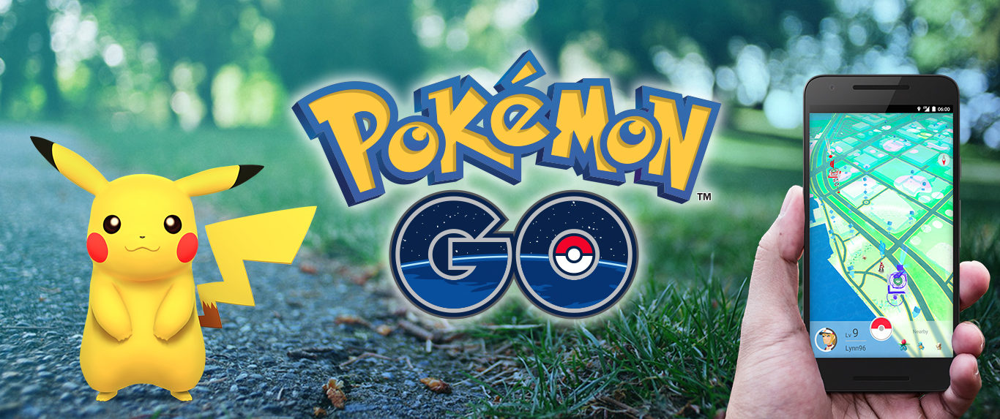

## Producto final
Puedes observar la interfaz del producto final [aquí](https://laurajimenezb.github.io/LIM013-data-lovers/src/index.html)

## Definición del Producto

#### ¿Quiénes son los usuarios?
Usuarios jugadores de PokemonGO, con conocimiento medio del juego (no principiantes).

#### ¿Cómo el producto soluciona las necesidades del usuario?
Nuestro producto da información que el jugador de POkemonGO necesita para completar su Pokedex y ganar en batallas Pokemon, todo en una misma págia web intuitiva y fácil de manejar.

#### Objetivos del producto
Ser fuente de información, útil y concisa para los usuarios jugadores de PokemonGO.

## Investigación de usuarios

### Guía de entrevista

#### Objetivos
* ¿Qué información desean visualizar los jugadores de PokemonGO en nuestro sitio web? 

Si bien esta es la pregunta principal, conocer las siguientes respuestas nos dará algunas luces sobre métodos para hacer conscientes a las personas, y si es que lo son o no.
* Preferencia de clasificación de los pokemons (alfabético, por tipo, etc.)
* Conocer la importancia de visualizar las características de cada pokemon 
* Averiguar si filtrar los pokemons por alguna característica es útil para los jugadores

#### I. Introducción 
Hola, Soy [entrevistador], y voy a conversar contigo hoy.
Esta entrevista es para conocerte un poco y tu interacción con PokemonGO. Nada de lo que hagas está bien o mal, ni vamos a juzgarte por eso. Antes que nada, ¿estás de acuerdo con que grabe esta entrevista? No será usada en otra cosa que no sea esta investigación, la grabación no será publicada sin tu autorización. Si en algún momento decides que no quieres continuar con la entrevista, puedes retirarte, no hay ningún problema.

#### II. Warming Up
Screener validation: 
* Nombre
* Edad
* Zona en la que vive
* Cuál/es juegos móviles son los que más juegan
* Qué le gusta/interesa de estos juegos
* ¿Conoce otros juegos de la marca Pokémon? > ¿Por qué prefiere jugar Pokémon GO?

#### III. Detailed Interview

**PokemonGO Roundabout**
* ¿Hace cuánto tiempo juega PokémonGO?
* ¿Con qué frecuencia juegas?
* ¿En qué nivel estás?
* ¿Qué es lo primero que haces al entrar a la aplicación? 
* ¿Cuánto tiempo le dedicas cada vez que inicias la aplicación?

**Roundabout I : Descubrir el mundo Pokemon**
* ¿Cómo te gustaría encontrar el listado de todos los pokémon? ¿En algún orden específico? ¿Por letra, por número, por poderes?
* ¿Conoces bien las características únicas de tus pokémon?
* ¿Qué te motiva a buscar/conocer un pokemon?

**Roundabout II : Atrapar distintos Pokémon para completar su Pokédex**
* ¿Consideras la posibilidad de atrapar todos los pokemon?
* ¿Sabes la frecuencia con la que aparece un pokemon?
* ¿Es muy importante evolucionar a un Pokemon y/o conocer sus evoluciones?
* ¿Qué datos son fundamentales conocer antes de evolucionar a un Pokemon?

**Roundabout III : Pelear contra entrenadores / conquistar un gimnasio**
* ¿Busca información sobre entrenadores del gimnasio antes de pelear?
* ¿Busca información sobre el gimnasio que desea conquistar?
* ¿Conquistar gimnasios es uno de tus objetivos en el juego?

**Roundabout IV: Competir en épicos combates contra otros entrenadores**
* ¿Qué lo motiva a pelear contra un entrenador?
* ¿Busca las fortalezas y debilidades del pokemon que elige el otro entrenador?
* ¿Qué característica de tus pokemon es importante para elegir al que peleará?

**Roundabout V : Hacer equipo con otros entrenadores**
* ¿Cuándo consideraría hacer equipo con otro entrenador?
* ¿Considera hacer equipo con el entrenador que tenga pokemon con específicas fortalezas/ataques?
* ¿Busca las debilidades de aquel que desean atrapar?

#### IV. Debrief
* De las cosas que hemos conversado, ¿ hay alguna cosa que quisieras saber o conocer luego de esta entrevista sobre el juego PokemonGO?
* Como mencione, es un poco para saber cómo interactúan los usuarios con este juego.

### Screenshots de entrevistas

----------------------

### Formulario Google
[Enlace del formulario](https://forms.gle/DMgwMfUx436QXyVL7)

### Resultados del formulario

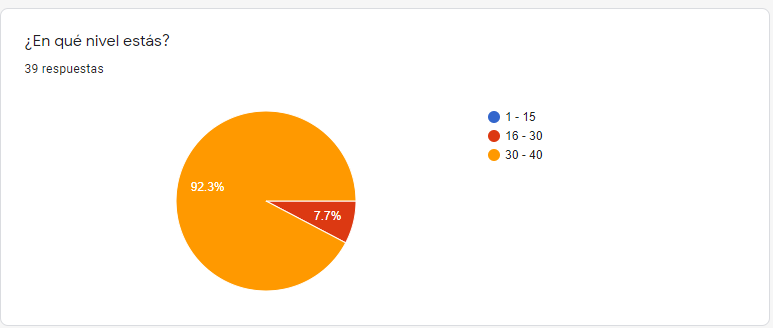
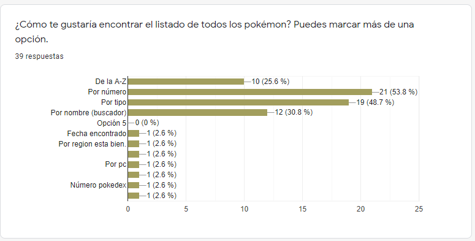

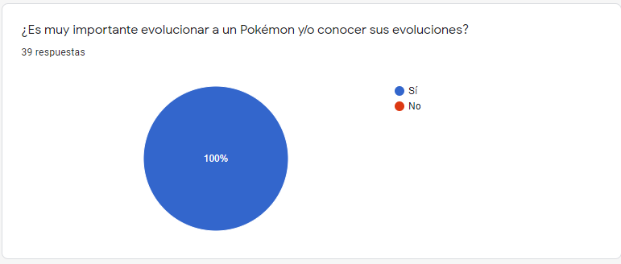
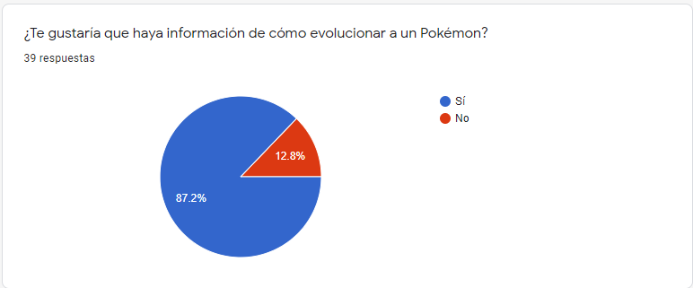

### Conclusiones de entrevistas y formulario Google
* La edad de los jugadores en su mayoría se encuentran entre los 20 y 30 años. 
* Los jugadores regulares de PokemonGo se encuetran en niveles altos del juego (nivel 30-40).
* El listado de pokemons es más fácil de visualizar de manera alfabética (A-Z).
* Los jugadores desean también la opción de filtrar por tipo, o a través de un buscador.
* Los jugadores en batalla consideran características como: ataques, fortalezas, debilidades y tipos, al momento de elegir el pókemon que peleará.
* Los jugadores consideran la evolución como importante, por lo que desean tener una sección con información de los métodos para la evolución.
* Una funcionalidad que los jugadores consideran importante es poder visualizar los pokemons que lesfalta para completar su pókedex.
* Una función útil para los jugadores es poder ingresar un pókemon y que se pueda visualizar su tipo, los tipos a los que es vulnerable y aquellos contra os que tiene ventaja.

## Diseño de Interfaz de Usuario
Los resultados de las entrevistas y cuestionarios nos ayudaron a entender las necesidades de los usarios, y contribuyeron a decidir qué funcionalidades desarrollaríamos en nuesto sitio web.

### PROTOTIPOS DE BAJA FIDELIDAD
Nuestros prototipos de baja fidelidad fueron hecho a lápiz y papel para poder iterarlos fácilmente. La idea inicial consistía en que la pantalla inicial mostrara una barra de navegación con botones de "Menu", un buscador y selectores para filtrar y/o ordenar las tarjetas de pokemones. Debajo de esta barra, se mostrarían todos los pokemones apenas se entre al sitio, y luego el número de ellos cambiaría al usar los botones.

------------
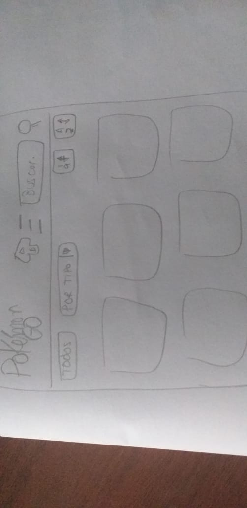

Luego, se diseñó un sistema de flujo por el cual el usuario observaría el sitio web, y se realizó en versión móvil. En esta etapa, se estableció crear dos funcionalidad aparte de el filtrado y ordenamiento de tarjetas. Debido al feedback que obtuvimos de los cuestionarios online, consideramos una ventana "Comparar" donde se pueden seleccionar 2 pokemon (el propio y el del oponente) para comparar las habilidades y ataques de ambos, y otra ventana de "Pokedex" donde el usuario puede seleccionar aquellos pokemons que ya ha capturado para poder visualizar aquellos que le faltan para completar su pokedex.

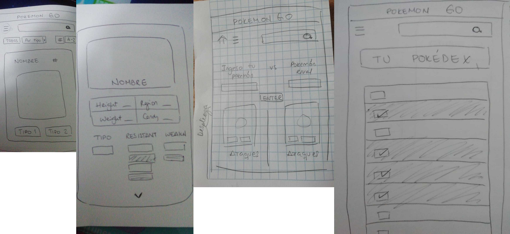

### TESTS CON USUARIOS
* La barra de navegación no era clara pues consistía en 2 filas. Una con el botón menu y el buscador, y otra debajo con los botones de filtrado. Se consideraba que no había jerarquía, y era confuso si se podía o no seleccionar solo 1 a la vez, o si se podía hacer click a todos.
* Se comentó que no era necesario tener un ícono de "home" y otro de "menú", sino que se decidiera por uno solo de menú, o se pusieran los botones de las diferentes ventanas uno al lado del otro.
* La idea de colocar una tarjeta a la vez en la pantalla móvil fue bien recibida, pues era fácil de visualizar y no agobiaban visualmente al usuario.

### PROTORIPO DE ALTA FIDELIDAD
Se tomaron en cuenta las opiniones de los usuarios y se decidió:
* Colocar una barra de navegación con un color llamativo con los botones de "Home", "Types" y el buscador.
* La ventana donde se visualizan los pokemons contedría una caja con un color distinto que contiene los selectores de "By name" y "By number". De esta forma, sería claro para el usuario que esta caja aplica a los pokemones visibles en la ventana luego de ser elegidos por tipo.

#### Diseño Desktop

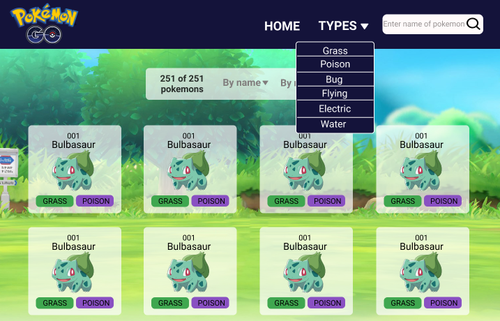
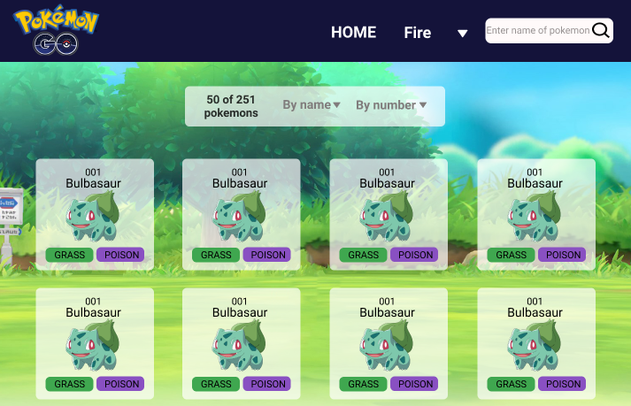
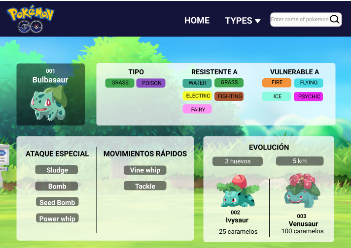
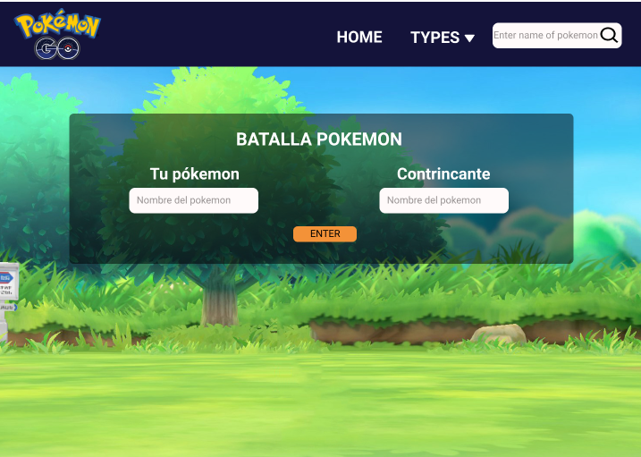

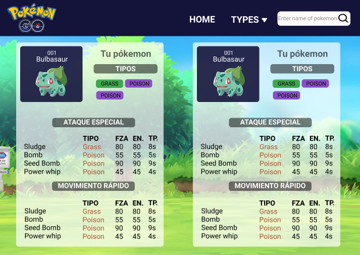

#### Diseño Móvil
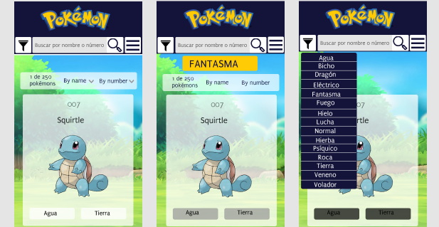
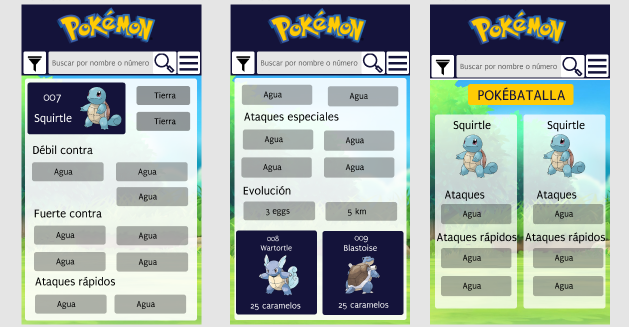

## Implementación de la interfaz de usuario

### Historia 1
Yo, como jugador avanzado de pokemonGO, quiero visualizar los pokemons por número (1-9) y de menor a mayor, para encontrarlos fácilmente.

#### Criterios de aceptación
* El jugador visualiza una barra de navegación, donde se encuentra el botón de "casita" (celular) o "home" (desktop)
* El jugador visualiza el listado de todos los Pokemons en orden numérico cuando presiona el botón "casita" (celular) o "home" (desktop)
* Cada tarjeta de pokemon debe contener el NOMBRE, NÚMERO, IMAGEN y TIPO de cada pokemon con el estilo planteado en el prototipo

#### Definición de terminado
* Pasar el test
* Diseño responsive
* Clickear el botón trae el número,nombre, imagen y tipo de cada pokemon
* Recibir feedback de por lo menos 3 usuarios.

Luego de concluida la Historia 1, el feedback que recibimos fue elegir un solo idioma para el sitio, o solo inglés o solo español. Además, el fondo de la ventana no constrataba con las cajas de tarjetas pokemon.

### Historia 2
Yo, como jugador avanzado de pokemonGO, quiero visualizar los pokemons por orden alfabético (A-Z y Z-A), para encontrarlos fácilmente.

#### Criterios de aceptación
* El jugador visualiza el listado de pokemons en la pantalla de inicio
* El jugador visualiza una caja debajo de la barra de navegación con el selector para ordenar alfabéticamente.
* El jugador puede seleccionar A-Z y Z-A
* El jugador visualiza los pokemons ordenados alfabéticamente
* El jugador puede ver la cantidad de pokemones que hay.

#### Definición de terminado
* Pasar el test
* Diseño responsive
* La función de conteo de pokemon funciona.
* Recibir feedback de por lo menos 3 usuarios.

Se estableció un fondo de pantalla con colores más vivos que contraste con la barra de navegación y las tarjetas. Además, el sitio web ahora tiene contenido solo en inglés. 

### Historia 3
Yo,como jugador regular de pokemonGO, quiero tener la opción de filtrar los pokemons por tipo, para ver los pokemons que pertenecen al tipo que busco.

#### Criterios de aceptación
* El jugador visualiza un botón en la barra de navegación para filtrar por tipo.
* El jugador visualiza un select con las opciones de filtrar por tipo.
* El jugador visualiza el nombre del tipo que selecciona y las tarjetas de los pokemones de ese tipo debajo.
* El jugador visualiza el número de pokemones que pertecen a cada tipo.
#### Definición de terminado
* Pasar el test
* Diseño responsive
* La función para filtrar por tipo desde el select funciona.
* La función de conteo de pokemon funciona por tipo.
* Recibir feedback de por lo menos 3 usuarios.

### Historia 4
Yo, como jugador avanzado, quiero buscar a mis pokemones directamente por nombre, para conocer todas sus características.

#### Criterios de aceptación
* El jugador visualiza un input con el símbolo de buscador e la barra de navegación.
* El jugador visualiza los pokemones filtrados desde que se ingresa la primera letra al input.
* El jugador visualiza el nombre del tipo que selecciona y las tarjetas de los pokemones de ese tipo debajo.
* El jugador visualiza el número de pokemones que coinciden con las letras que se van ingresando.
#### Definición de terminado
* Diseño responsive
* La función para filtrar a medida que se ingresa valores al input funciona.
* La función de conteo de pokemon funciona desde el ingreso de la primera letra.
* Recibir feedback de por lo menos 3 usuarios.

Compartimos nuestra idea para la próxima historia, qque consiste en ir a otra sección luego de hacer click a la tarjeta de pokemon que muestre sus características. Debido al feedback se decide crear una ventana modal en lugar de que aparezca en lugar de la pestaña de inicio, pues no permitiría volver a las tarjetas filtradas sino al inicio general con todos los pokemones.

### Historia 5
Yo, como jugador experto de pokemonGO, quiero visualizar las características, fortalezas y debilidades de cada pokemon, para saber cuál elegir en una pelea.

#### Criterios de aceptación
* El jugador visualiza una ventana modal al hacer click en una de las trajetas de pokemon.
* El jugador visualiza las características principales del pokemon deltro de la ventana modal.
* El jugador deja de vosualizar esta ventana modal al hacer click en la "x".
#### Definición de terminado
* Diseño responsive
* La ventana modal sigue el modelo del prototipo.
* La función de seleccionar un pokemon y ver sus características en la ventana funciona.
* La función de cerrar la ventana modal funciona.
* Recibir feedback de por lo menos 3 usuarios.

### Historia 6
Yo, como jugador en combate, quiero saber el tipo de pokémon que tengo, sus contra que tipos son débiles  o fuertes, y los mismos datos del pokemon de mi rival, para elegir aquel que tenga más posibilidades de ganar.

#### Criterios de aceptación
* El jugador visualiza un botón "Battle" en la barra de navegación.
* El jugador visualiza una ventana con dos inputs: "mi pokemon" y "pokemon oponente".
* El jugador visualiza una lista con sugerencias desplegada del input desde que ingresa la primera letra.
* El jugador visualiza las tarjetas de los pokemones seleccionados en cada input, lado a lado.
#### Definición de terminado
* Diseño responsive
* Esta sección sigue el modelo del prototipo.
* La función de dessplegar las sugerencias en el input funciona.
* La función de mostrar las tarjetas con el input funciona.
* Recibir feedback de por lo menos 3 usuarios.
* Subir a gh-pages.

